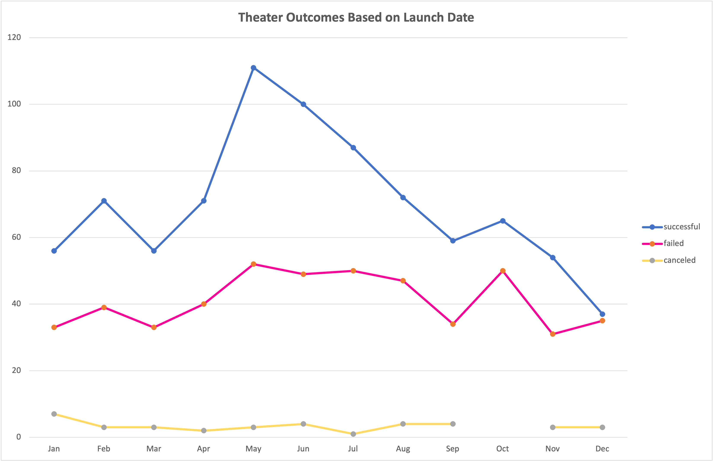
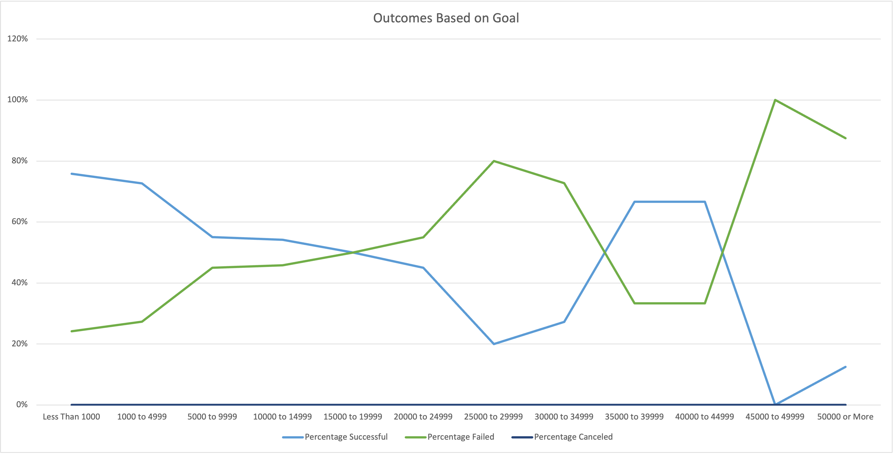

# Kickstarting with Excel

## Overview of Project
Louise is a play writer who had a successful Kickstarter campaign for her play "Fever" but now wants to compare her success to that of others. The goal of this project was to determine how other plays' Kickstarters met their goals in the areas based on their lauch dates and overall fundraising goals. To accomplish the goal, we used excel functions such as Pivot Tables, various graphical charts and formulas to find the desired answers. 

### Purpose
By finding how other Kickstarter campaigns did in relation to their launch date and overall fundraising goals, Louise can now have a much better understanding of what key factors result in certain Kickstarters being successful which will in turn allow Louise to structure her future Kickstarter Campaigns that are in line with the results of this project to help ensure she is set up for meeting her fundraising goals in the time desired. 

## Analysis and Challenges

In order to set up the worksheet to help analyze the data, I went through each column of data and reviewed whether the data format was readable or if it would need to be adjusted to help us use the data properly. 

First, Column N included Category and Subcategory and because the formatting was consistent, I used the Text to Columns function to separate the Category from Subcategory to make it visually easier to sort and filter the data. 

Second, I converted the dates in the Date Creates and Date Ended columns to a more readable "Short Date" format. For the Date Created Conversion, in a new column (S), I inserted the following formula =(((J2/60)/60)/24)+DATE(1970,1,1). The formula was created to convert the Unix date value in Cell J2 to a Short Date form in Column S. I used the same formula to convert Column I to a short date form for the Date Ended Conversion. 

In column U, I used the YEAR() formula to convert the short date in column S to just show us the year that the Kickstarter ran. This will allow me to use the Years column in my PivotTable when displaying the outcomes by launch date. 

### Analysis of Outcomes Based on Launch Date

Now that the data was formatted the way I needed, I started the analysis. The first analysis I completed was for "Theater Outcomes Based on Launch Date". I created a PivotTable using all of the data from my Kickstarter sheet. I placed the Parent Category and Years in the filters section, Outcomes in the Series section, Date Created Conversion in the Categories section and lastly the count of outcomes in the Values section.

Next, I filtered the Parent Category to theater, as we were only reviewing theater plays for this analysis. I then filtered the Outcomes to eliminate live Kickstarters and they don't have complete data so it would skew the results of our analysis

Once the PivotTable was sorted and filtered as described, I inserted a Line Chart with Markers to visualize that data. 

### Analysis of Outcomes Based on Goals

I started out with creating a new worksheet for Outcomes Based on Goals and added the following columns: Goal, Number Successful, Number Failed, Number Canceled, Total Projects, Percentage Successful, Percentage Failed and Percentage Canceled. 

For the goal column, I listed out dollar amount ranges so that projects would be grouped by similar goals. After the basic table was created, I started to add formulas in the columns to get the output. The formula I used to find Number Successful was =COUNTIFS(Kickstarter!$D:$D,"<1000",Kickstarter!$F:$F,"successful",Kickstarter!$R:$R,"plays"). I wanted to count the number of kickstarters that had "successful" listed in column F, and "plays" listed in Column R (Subcategory) and satisfied the goal range listed in Column A which for this example was Less than $1000. Once that was completed, I was then able to copy the formula down for all of the goals listed. To ensure the reference stayed correct, I used the Absolute Reference for the range ("$F:$F"). 

Now that the COUNTIFS() formula worked for the successful outcomes, I was able to copy the formula into column C and adjust the absolute reference for column F to be "failed"  and followed the same formula structure as Column B. I did the same for Column D which was "canceled" plays. 

For Column E - "Total Projects" I took the sum of columns B, C, and D and then copied the formula down for all of the goals. In row 14, I used the sum formula to total each column so I could gut check my numbers along the way. 

To find the Percentage Successful, Failed and Canceled in Columns, F, G and H - I used the formula Number of Projects divided by the total for each category of successful, failed and canceled. 

Once the table was completed, I inserted a line chart to visualize the Outcomes Based on the Goal. 

### Challenges and Difficulties Encountered

The challenges I encountered in finding Theater Outcomes by Launch Date were finding the correct sections for the various field names in the PivotTable. Although the challenge directions showed an example, I did have to play around with putting outcomes not only as a count in the values field but also in the column field as well to get the sort to match. When I pulled the Date Created Conversion into the rows field, it listed Years, Quarters and Date Created Conversion under Rows which then had the PivotTable showing all of the years they had Kickstarters instead of all of the campaigns by month no matter the year so I had to move the year field into the filter section and then remove the Years and Quarters from the row section. 

It also took me a couple of tries to get the sort of campaign outcomes from successful being in the first column. I initially thought it was a filtering issue or something I could fix in the PivotTable field section but after not finding a solution. I tried to manually click and move the column which ended up being the fix. 

## Results

- What are two conclusions you can draw about the Outcomes based on Launch Date?

    The two conclusions I can draw about the Outcomes based on Launch Date are that by far May, June and July were the most successful months to launch a campaign. It seems that the campaigns that failed or were canceled had on average the same rate throughout the year, there weren't any specific months that stood out  againist the others. 

- What can you conclude about the Outcomes based on Goals?

    I can conclude that the Outcomes based on Goals showed that overall as the fundraising goal increased, the number of successful campaigns decreased. The only goals that did not follow that trend were the range of $35,000 to $45,000 goals were showed a sharp increase over the previous goal range. 

- What are some limitations of this dataset?

    The limitations of the dataset from my perspective are that there could be outliers in other columns of the data that may skew the successful numbers of campaigns such as if some of the campaigns only had a few backers that gave very large doantions that allowed them to meet their goal versus others that may have needed to get a significant amount of donors in order to meet the goal. That information isn't reflected or visible in the data categories I used to formulate the Outcomes Based on Launch Date and Outcomes based on Goals. The other limitation I see that can't really be reflected in the data provided is the amount of marketing dollars or reach that each of the campaigns had that would influence their success or lack thereof. 

- What are some other possible tables and/or graphs that we could create?

    The other possible tables and graphs I would could create to help analyze the data would be a box and whisker plot in regards to the number of backers and average donation. Also looking at other Parent or subcategories and using line charts for their outcomes vs goals and launch date that could determine if the trend was specific to theater plays or if it was similar in other categories. 